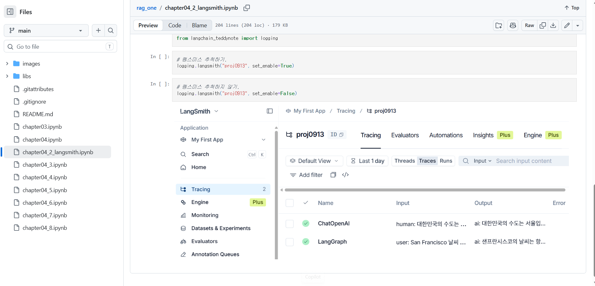

# 2026-09-14 LangChain & LangSmith

## 학습 내용

- LangChain / LangGraph 기본 실습
- `.env`를 이용한 API Key 및 환경변수 관리
- LangSmith 설정 및 Tracing
- ChatOpenAI 호출 과정 추적
- LangGraph Agent와 Tool 실행 과정 추적

---

## 1. 환경변수 설정

API Key와 LangSmith 설정값은 `.env` 파일에서 관리한다.

```env
OPENAI_API_KEY=...
LANGSMITH_API_KEY=...
LANGSMITH_ENDPOINT=https://api.smith.langchain.com
LANGSMITH_PROJECT=test0914
LANGSMITH_TRACING=true
```

환경변수 로드:

```python
from dotenv import load_dotenv
import os

load_dotenv()

print("OpenAI 키:", os.getenv("OPENAI_API_KEY")[:8] + "...")
print("LANGSMITH 키:", os.getenv("LANGSMITH_API_KEY")[:8] + "...")
print("LangSmith 프로젝트:", os.getenv("LANGSMITH_PROJECT"))
```

> `.env`에는 실제 API Key가 있으므로 GitHub에 업로드하지 않는다.

---

## 2. `.gitignore`

API Key와 가상환경 등이 Git에 올라가지 않도록 제외한다.

```gitignore
.env
.venv/
__pycache__/
*.pyc
```

---

## 3. LangSmith

LangSmith는 LLM 및 AI Agent의 실행 과정을 추적하고 확인하기 위한 도구이다.

### 주요 역할

- LLM 입력과 출력 확인
- Agent 실행 과정 추적
- Tool 호출 과정 확인
- 오류 발생 위치 확인
- 실행 결과 디버깅 및 평가

쉽게 정리하면:

> **LangSmith = AI Agent가 내부에서 어떻게 동작했는지 확인하는 추적·관찰 도구**

---

## 4. LangSmith Tracing

```python
from langchain_teddynote import logging

# LangSmith 추적 시작
logging.langsmith("test0914", set_enable=True)
```

추적을 중지할 때:

```python
logging.langsmith("test0914", set_enable=False)
```

---

## 5. LangGraph Agent + Tool

날씨를 알려주는 간단한 Tool을 만들고 Agent에 연결했다.

```python
from langchain_openai import ChatOpenAI
from langchain_core.tools import tool
from langchain.agents import create_agent

@tool
def get_weather(city: str) -> str:
    """Get weather for a given city."""
    return f"It's always sunny in {city}!"

llm = ChatOpenAI(
    model="gpt-4o-mini",
    temperature=0
)

agent = create_agent(
    model=llm,
    tools=[get_weather]
)

result = agent.invoke({
    "messages": [
        ("user", "San Francisco 날씨 어때?")
    ]
})

print(result["messages"][-1].content)
```

실행 흐름:

```text
사용자 질문
   ↓
Agent
   ↓
LLM 판단
   ↓
Tool 선택 및 실행
   ↓
Tool 결과
   ↓
최종 답변
   ↓
LangSmith에 Trace 기록
```

---

## 6. LangSmith Tracing 결과

ChatOpenAI와 LangGraph 실행 결과가 LangSmith의 `test0914` 프로젝트에 정상적으로 기록되는 것을 확인했다.



---

## 핵심 정리

| 개념 | 역할 |
|---|---|
| LangChain | LLM 기반 애플리케이션 구성 |
| LangGraph | Agent의 실행 흐름 구성 |
| Tool | Agent가 사용할 수 있는 기능 |
| LangSmith | LLM / Agent 실행 과정 추적 및 디버깅 |
| `.env` | API Key 등 환경변수 관리 |
| `.gitignore` | `.env`, `.venv` 등 Git 업로드 제외 |

### Agent 개발에서 중요

최종 답변만 확인하는 것이 아니라 LangSmith를 이용하면

**질문 → 모델 판단 → Tool 호출 → 결과 → 최종 답변**

전체 실행 흐름을 확인할 수 있다.

따라서 Agent가 예상과 다르게 동작하거나 오류가 발생했을 때 **어느 단계에서 문제가 발생했는지 확인하는 데 활용할 수 있다.**